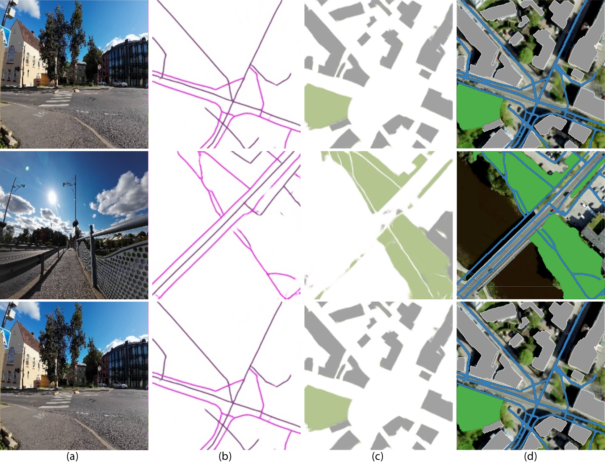

# Street2GIS
Street2GISis is an open-source framework that generates GIS shapefiles from street-view imagery and geospatial coordinates. Street2GIS employs monocular depth estimation to analyze depth information from street- view images, enabling a detailed understanding of urban environments.
## Abstract
The advancement of autonomous navigation technologies has revolutionized delivery robots and micromobility services, which depend on precise GIS data for navigating urban environments. However, the lack of detailed pedestrian infrastructure data poses challenges for systems operating on sidewalks and pathways. To address this, we present Street2GIS, an open-source framework that generates accurate GIS shapefiles from street-view imagery and geospatial coordinates. Street2GIS employs monocular depth estimation to analyze depth information from street-view images, enabling a detailed understanding of urban environments. This is followed by applying a semantic segmentation model to categorize key urban features such as roads, sidewalks, buildings, and vegetation from a top-down perspective. CrossMLP models further enhance the accuracy of feature extraction and spatial alignment. To ensure the quality of the generated data, the framework uses advanced evaluation techniques, including ORB keypoint matching to establish spatial correspondence, RANSAC homography for refining alignment, and structural similarity metrics (SSIM) to assess visual consistency and precision. The framework achieves an F1-score exceeding 90\% for semantic segmentation and demonstrates encouraging performance, with overall average alignment and similarity scores of 91\% and 72.95\%, respectively. By streamlining the process of GIS data acquisition, Street2GIS offers a scalable solution capable of near real-time data generation, enabling efficient updates to address the dynamic needs of autonomous navigation systems. This capability provides a practical approach for integrating contextualized pedestrian infrastructure into GIS workflows, supporting more adaptive and responsive urban mobility solutions.
## Directory Structure
```plaintext
Street2GIS/
├── models/
│   ├── main.py
│   └── utils.py
├── dataset/
│   ├── delta/
│   ├── crossMLP1/
│   └── main/
│      ├── test/
│      └── train/
├── utils/
├── train.py
├── test.py
└── README.md
```
## Framework Results

Figure 1: Results after applying the framework (a) Street View, (b) Street and Sidewalk, (c) Vegetation and Building, and (d) GIS elements.



